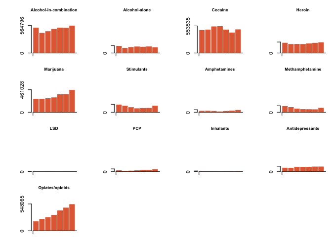
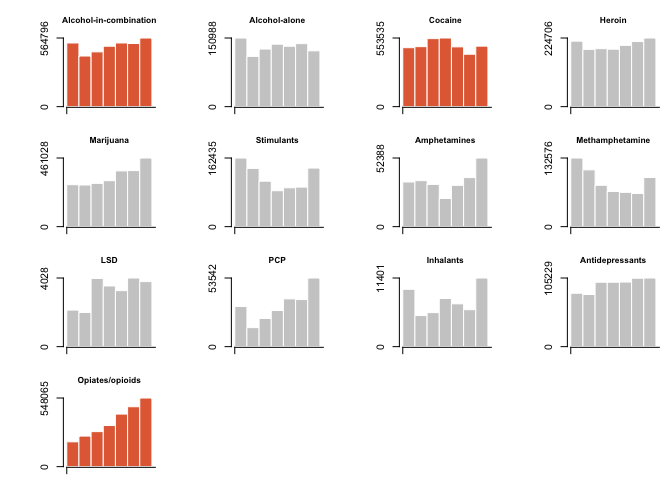

Drug Related Emergency Department Visits in the US, 2004 to 2011 - Small Multiples
================
Erin Hutcheson
February 4, 2018

### source: <https://www.samhsa.gov/data/emergency-department-data-dawn/reports>

### data: National Estimates of Drug-Related Emergency Department Visits, 2004-2011 - All Misuse and Abuse

``` r
library(dplyr)
```

    ## 
    ## Attaching package: 'dplyr'

    ## The following objects are masked from 'package:stats':
    ## 
    ##     filter, lag

    ## The following objects are masked from 'package:base':
    ## 
    ##     intersect, setdiff, setequal, union

### 1. Wrangling the data

``` r
setwd("/Users/erinhutcheson/Desktop/r1")


# The file starts with 6 blank rows before the header, so when loading it, I utilize the command "skip = 6" in order to delete the rows.  Also, in place of NA this file uses *.   I am replacing * with NA

emergencyroom <- read.csv("EmergencyRoom.csv", skip=6, na.strings = c("*"), header=TRUE,  stringsAsFactors=FALSE, sep=",", colClasses=c("Drugs"="character"))


# There are 578 observations. Due to this, in the following command, I simplify the data by only keeping some of the observations

ER <- emergencyroom %>%
  select (Drugs:Estimates.2011) %>%
  filter (Drugs %in% c("Alcohol-alone", "Cocaine", "Heroin", "Marijuana", "Stimulants", "Amphetamines",    
  "Methamphetamine", "LSD", "PCP", "Inhalants", "Antidepressants", "Opiates/opioids", "Alcohol-in-combination"))
```

### 2. Ensuring that the data is numeric

``` r
write.csv(ER, "ER.csv", row.names = FALSE)

ER <- readr::read_csv("ER.csv")
```

    ## Parsed with column specification:
    ## cols(
    ##   Drugs = col_character(),
    ##   Estimates.2004 = col_number(),
    ##   Estimates.2005 = col_number(),
    ##   Estimates.2006 = col_number(),
    ##   Estimates.2007 = col_number(),
    ##   Estimates.2008 = col_number(),
    ##   Estimates.2009 = col_number(),
    ##   Estimates.2010 = col_number(),
    ##   Estimates.2011 = col_number()
    ## )

### 3. I used the below code to create bar charts for each drug type. Each bar chart shows the rate of change for specific drug related visits from 2004 -2011. I specified that the y axis should go to 700,000.00 (The maximum amount of drug related visits is a little under 700,000.00), I did this so that each bar chart has the same paramters and we can compare the charts. The only problem is that for some drugs there are many more drug related visits than for other drugs, so setting the y axis at 700,000 makes it so that you cannot even see the bars of some of the barcharts.

``` r
ER <- as.data.frame(ER)

par(mfrow=c(4,4), mar=c(1,5,3,1))
for (i in 1:length(ER[,1])) {
    currDrug <- ER[i,2:8] 
     
    # Draw bar plot with no axes, same vertical scale
    barplot(as.numeric(currDrug), main=ER[i,1], cex.main=0.8, cex.axis=0.7, border="white", col="#e26b43", space=0, axes=FALSE, ylim=c(0,700000))
     
     # Draw custom axes
    axis(side=1, at=c(0,11), labels=FALSE)
    axis(side=2, at=c(0,max(currDrug)), cex=0.7)
    
    }
```



\#\#\#.5 In order to solve the above issue of having some graphs where the data isn't visible because the y axis dwarfs it, I created the below code in which each bar graph has a suitable y axis for that individual graph, but in order to be able to compare bar graphs, the ones in which there are more than 500,000 visits in any year are highlighted in orange.

``` r
# Highlighting
par(mfrow=c(4,4), mar=c(1,5,3,1))
for (i in 1:length(ER[,1])) {
    currDrug <- as.numeric( ER[i,2:8] )
     

     
    # Color based on whether in any year the drug related emergency department visits was greater than 400,000.00
    if (max(currDrug) >500000) {
        barColor <- "#e26b43"    # Orange-red
    } else {
        barColor <- "#cccccc"    # Gray
    }
     
    # Draw the bar plot
    barplot(currDrug, main=ER[i,1], cex.main=0.8, cex.axis=0.7, border="white", col=barColor, space=0, axes=FALSE)
    axis(side=1, at=c(0,11), labels=FALSE)
    axis(side=2, at=c(0,max(currDrug)), cex=0.8)
}
```


